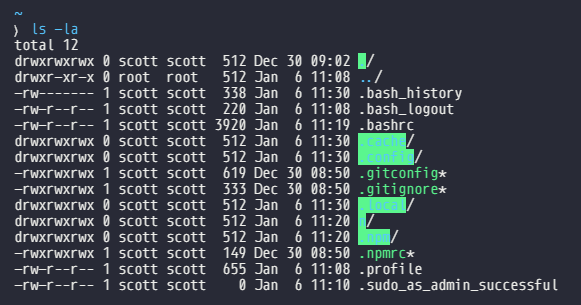
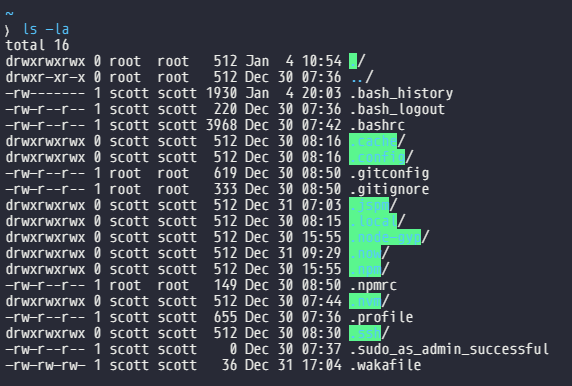

I'm a Windows user, I have been a Linux user as well but I have found
that Windows is a bit less [neckbeardy][fixanycomputer] for me, both
have their pros and cons. One of the big cons with Windows for me was
when I started learning web development.

That was until Windows Subsystem Linux came along 🙏

I love it, you can have a bash shell in Windows and run all your node
apps through it too and with the Windows 10 Fall Creators Update WSL
is really straightforward to set up.

Quick backstory on why I'm posting this: I nuked my laptop the other
day as I was having issues with bash on Windows. Related partly to
using [nvm][slowbash] with WSL and generally getting frustrated with
how my computer was performing. I realise now I over reacted.

So I have had to set up my development environment again from scratch,
luckily for me I keep all my settings and config information in a
GitHub [repo][settingsrepo] in the event of me getting a new computer
or to recover from a catastrophic event [like a nuked computer].

Here's how I set up _my_ Windows Subsystem Linux for my development
environment.

This is my opinionated view on my specif setup and usage of WSL and
this is my step by step guide for the next time I have to spin up a
development environment from scratch on Windows.

So, after installing [WSL][wslmsstore] from the Microsoft Store and
adding your default user, fist thing is to update and upgrade all the
things.

```bash
sudo apt update
sudo apt -y upgrade
```

If you've not used any Linux distributions before the `-y` in the
upgrade statement is to default the answer to yes for any prompts that
are displayed in the terminal. You might not want to do this, as there
may be some programs you don't want to update but I do.


You wont have these messages 👆

### Build tools

To compile and install native addons from npm you may also need to
install build tools, I need this for Gatsby images which uses `sharp`
which in turn uses `node-gyp`:

```bash
sudo apt install -y build-essential
```

### Install node

Installing node via the instructions given on the nodejs.org site
doesn't give the correct permissions for me, so when trying to
`npm install` anything I get errors, I found using [using `n`][usen]
helps:

### Install node with `n`

As it's a fresh install then we can go ahead and use [n-install] with:

```bash
curl -L https://git.io/n-install | bash
```

This will install the latest stable version of node 👍

Once the script is complete restart bash with:

```bash
. /home/my_user_name/.bashrc # the n prompt displays this for you to copy pasta
```

Check your node and npm versions:

```bash
node -v && npm -v
```

### Install fish 🐟🐚

Fish is now my go to shell purely for the auto complete/intellisense
there's also some nice themes you can get for it too.

There's two options here, one is to use the standard package that come
pre installed with the Ubuntu install or you can use the Fish [PPA]

**Use the standard package:**

```bash
sudo apt -y install fish
sudo apt -y upgrade && sudo apt -y autoremove
```

**Use the Fish shell [PPA]:**

```bash
sudo apt-add-repository ppa:fish-shell/release-2
sudo apt update && sudo apt -y install fish
```

### Install Oh My Fish | OMF

Oh My Fish is like a package manager for Fish enabling the instal of
packages and themes.

```bash
curl -L https://get.oh-my.fish | fish
```

### Install OMF theme

```bash
omf install clearance
```

### The start of the beginning

Ok, so that is a basic setup for WSL, you'll probably want to get Git
set up now, I have been using SSH over HTTPS for a while now on WSL.

> At the time of writing this WSL Git integration with VSCode doesn't
> work so I have added a Git install to my windows machine, you can
> omit this and go full Git via the terminal but I really like the
> VSCode git integration.

To get SSH set up on your machine take a look at this [handy SSH
setup]. I say SSH instead of HTTPS 1. because I had all sorts of
issues with the Git credential manager and the keyring manager in the
end it was actually quicker to create an SSH key and authenticate with
GitHub - the guide I linked walks you through it.

### Move your dotfiles

If you have all your [dotfiles] backed up in a GitHub repo then now is
a good time to add them to your WSL folder, the last times I did this
I manually set the permissions after moving each of the the files but
have since discovered [`rsync`][rsync] to move all the files.

```bash
rsync -avzh /mnt/c/Users/dotfiles/ ~/
```

That will copy the contents of my `dotfiles` folder to the `~/` (home)
directory in WSL, you can check them with:

```bash
ls -la ~/
```



I copied across my `.gitconfig`, `.gitignore` and `.npmrc` dotfiles
pictured here and you can see that the permissions are not consistent
with the `.bashrc` file.

So, the only way I know how to change the file permissions is with
`chmod` to get the ordinals of a similar file use `stat`:

```bash
stat -c "%a %n" ~/.*
```

This will list out all everything that begins with a `.` here's mine:

```bash
777 /home/scott/.
755 /home/scott/..
600 /home/scott/.bash_history
644 /home/scott/.bash_logout
644 /home/scott/.bashrc
777 /home/scott/.cache
777 /home/scott/.config
777 /home/scott/.gitconfig
777 /home/scott/.gitignore
777 /home/scott/.local
777 /home/scott/.npm
777 /home/scott/.npmrc
644 /home/scott/.profile
644 /home/scott/.sudo_as_admin_successful
```

I only want to change `.gitconfig`, `.gitignore` and `.npmrc` here so
I'm going to do this:

```bash
chmod 644 .gitconfig .gitignore .npmrc
```

And now my files look like this. 👍



Ok now were up and running with an up to date Ubuntu install, node and
fish terminal. Of course there's still the case of installing all your
global npm packages you want for development now.

<!-- links -->

[ppa]: # 'Personal Package Archive'
[fixanycomputer]: http://theoatmeal.com/blog/fix_computer
[slowbash]: https://github.com/Microsoft/WSL/issues/776
[wslmsstore]: https://www.microsoft.com/store/productId/9NBLGGH4MSV6
[usen]:
  https://github.com/Microsoft/WSL/issues/776#issuecomment-266112578
[settingsrepo]: https://github.com/spences10/settings
[dotfiles]: https://github.com/spences10/dotfiles
[handy ssh setup]:
  https://github.com/spences10/cheat-sheets/blob/master/git.md#how-to-authenticate-with-github-using-ssh
[rsync]:
  https://www.tecmint.com/rsync-local-remote-file-synchronization-commands/
[n-install]: https://github.com/mklement0/n-install
